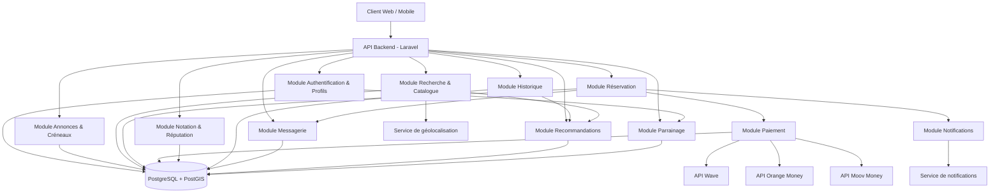
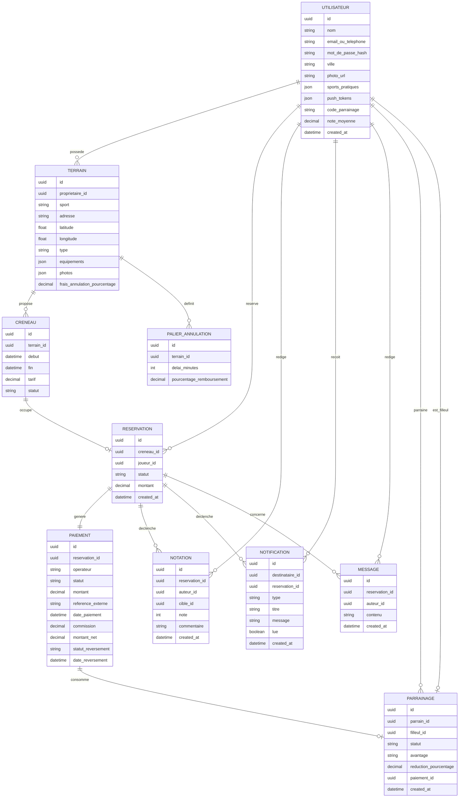

# Architecture — App de réservation de terrains de sport entre particuliers

*Rédigé le 22 août 2026, à partir du SRS validé (srs.md, rédigé le 22 août 2026)*
*Révision du 29 août 2026 : correction du modèle de données (section 3) — voir note en fin de
section 3.*
*Révision du 30 août 2026 : détail des modules Should/Could have restants (section 2) et
correction du modèle de données pour Messagerie/Parrainage (section 3) — voir notes correspondantes.*

## 1. Stack technique

### Backend

| Option | Avantages | Inconvénients | Exigences couvertes |
|--------|-----------|----------------|----------------------|
| **Laravel (PHP)** | Écosystème mature pour l'intégration mobile money en Afrique de l'Ouest (packages/communauté déjà familiers de Wave, Orange Money, Moov Money) ; queues et scheduler intégrés utiles pour traiter les webhooks de paiement et les rappels ; grande disponibilité de développeurs locaux | Moins "à la mode" que Node/Python pour certaines équipes ; performances brutes inférieures à Node pour de la charge très concurrente | RNF-002, RNF-005 |
| **Node.js (NestJS, TypeScript)** | Un seul langage possible du backend au frontend/mobile (si React/React Native) ; bon débit pour de l'I/O concurrent (utile pour verrouillage de créneau RF-010) | Écosystème d'intégration mobile money local moins mature que Laravel ; plus de discipline requise pour éviter la dette technique sans framework aussi structurant | RNF-001, RNF-002 |
| **Django (Python)** | Panneau d'administration intégré très utile pour gérer litiges/remboursements côté équipe interne ; ORM robuste | Moins orienté "temps réel" ; écosystème mobile money local plus restreint que Laravel | RNF-002 |

**Recommandation** : **Laravel** — c'est l'option la mieux alignée avec le contexte (paiement Wave/Orange Money/Moov Money) : l'écosystème et les développeurs disponibles dans la zone connaissent déjà ces intégrations, ce qui réduit le risque d'implémentation sur le point le plus critique du projet (RNF-002 — sécurité des paiements, RNF-005 — disponibilité du chemin réservation/paiement).

### Frontend / Mobile

| Option | Avantages | Inconvénients | Exigences couvertes |
|--------|-----------|----------------|----------------------|
| **Next.js (web) + React Native (mobile)** | Un seul langage (TypeScript) partagé entre web et mobile, logique métier réutilisable ; large communauté | React Native peut demander du code natif ponctuel pour certaines intégrations SDK de paiement mobile money | RNF-003 |
| **Nuxt (web) + Flutter (mobile)** | Flutter offre un rendu très proche du natif et de bonnes performances sur iOS/Android | Deux langages différents (JS/Dart) pour web et mobile, pas de partage de code entre les deux | RNF-003 |
| **Web responsive seul (Vue/Nuxt) + apps natives séparées (Swift/Kotlin)** | Meilleure expérience et performance natives possibles | Trois bases de code distinctes à maintenir (web, iOS, Android) — coût de développement et de maintenance nettement plus élevé | RNF-003 |

**Recommandation** : **Next.js + React Native** — couvre la cible "web et mobile iOS/Android dès la V1" (RNF-003) avec un seul langage et un partage de logique entre les plateformes, ce qui limite les incohérences de comportement entre web et mobile pour des parcours critiques comme la réservation et le paiement.

### Base de données

| Option | Avantages | Inconvénients | Exigences couvertes |
|--------|-----------|----------------|----------------------|
| **PostgreSQL (+ extension PostGIS)** | Garanties transactionnelles fortes (essentiel pour éviter une double réservation sur un créneau, RF-010) ; PostGIS permet la recherche par proximité (RF-007) nativement | Configuration légèrement plus lourde que MySQL pour activer PostGIS | RF-007, RF-010, RNF-002 |
| **MySQL / MariaDB** | Pairing classique avec Laravel, simple à opérer, extensions spatiales disponibles | Support géospatial moins riche et moins éprouvé que PostGIS | RF-007 |
| **MongoDB** | Schéma flexible, pratique pour prototyper vite | Garanties transactionnelles multi-documents plus faibles — risque direct sur le verrouillage de créneau (RF-010) et la cohérence paiement/réservation | — |

**Recommandation** : **PostgreSQL avec PostGIS** — c'est la seule option qui répond directement aux deux contraintes les plus sensibles du projet : la cohérence transactionnelle nécessaire pour éviter qu'un même créneau soit réservé deux fois (RF-010), et la recherche géographique par proximité (RF-007).

### Hébergement / Infrastructure

| Option | Avantages | Inconvénients | Exigences couvertes |
|--------|-----------|----------------|----------------------|
| **Cloud managé (AWS/GCP) avec base de données managée** | Haute disponibilité et sauvegardes gérées, bonne base pour viser RNF-005 (99,5 %) | Coût et complexité d'exploitation plus élevés pour une V1 | RNF-005 |
| **PaaS (ex. Render, Railway, ou hébergeur régional type OVH)** | Déploiement simple, coût maîtrisé, bon compromis pour une V1 ; certains hébergeurs régionaux offrent une meilleure latence vers l'Afrique de l'Ouest | Moins de contrôle fin sur l'infrastructure qu'un cloud complet | RNF-001, RNF-005 |
| **VPS auto-géré (Docker)** | Coût le plus faible | Redondance et sauvegardes à mettre en place manuellement — risque pour RNF-005 si mal opéré | — |

**Recommandation** : **PaaS ou hébergeur régional** — meilleur compromis coût/fiabilité pour une V1, en portant une attention particulière à la latence réseau vers les API Wave/Orange Money/Moov Money (privilégier une région d'hébergement proche de l'Afrique de l'Ouest).

> **⚠️ Ce choix de stack doit être confirmé avant de considérer les sections suivantes comme figées** — voir la section Validation en fin de document.

## 2. Structure des modules/composants

| Module | Responsabilité | Exigences couvertes |
|--------|------------------|----------------------|
| Authentification & Profils | Inscription, connexion, gestion du profil joueur | RF-001, RF-002, RF-003 |
| Annonces & Créneaux | Publication d'annonces (particulier ou gestionnaire), définition des créneaux et tarifs | RF-004, RF-005, RF-006 |
| Recherche & Catalogue | Recherche par sport/localisation/date, consultation du détail d'une annonce, filtres avancés (prix/distance/équipements) | RF-007, RF-008, RF-009, RF-022 |
| Réservation | Sélection d'un créneau, verrouillage temporaire, confirmation après paiement, annulation et remboursement | RF-010, RF-014, RF-021 |
| Paiement | Abstraction commune aux trois opérateurs, déclenchement du paiement, réception des webhooks, reversement | RF-011, RF-012, RF-013, RF-015 |
| Notation & Réputation | Enregistrement des notes/commentaires post-session, calcul de la note moyenne | RF-016, RF-017 |
| Historique | Consultation de l'historique des réservations (joueur et propriétaire/gestionnaire) | RF-018, RF-019 |
| Notifications | Confirmation de réservation, rappels avant créneau | RF-020 |
| Messagerie | Échange de messages entre un joueur et un propriétaire/gestionnaire au sujet d'une réservation | RF-023 |
| Recommandations | Suggestion de terrains à un joueur à partir de son historique de réservations | RF-024 |
| Parrainage | Parrainage d'autres utilisateurs et suivi des avantages associés | RF-025 |

> **Révision du 30 août 2026** : la version initiale de ce tableau laissait les modules Should/
> Could have "non détaillés". RF-021 (annulation/remboursement) et RF-022 (filtres de recherche)
> n'ont finalement pas eu besoin d'un module dédié — ce sont de simples extensions de Réservation
> et Recherche & Catalogue (colonnes "Exigences couvertes" mises à jour ci-dessus en conséquence).
> RF-023 (Messagerie), RF-024 (Recommandations) et RF-025 (Parrainage) sont en revanche de vraies
> capacités supplémentaires, détaillées ci-dessus comme modules à part entière — voir la section 3
> pour les ajouts au modèle de données que ça a nécessités (ou pas, pour Recommandations).

## 3. Modèle de données

> **Correction du 29 août 2026** : `sports_pratiques` (liste parmi foot/tennis/basket) a été
> ajouté à l'entité UTILISATEUR. Ce champ était exigé par RF-001 (inscription) et RF-003 (édition
> du profil) mais absent de la version initiale du modèle de données — l'écart a été repéré lors
> de l'implémentation d'US-03. Modélisé en `json` plutôt qu'en table de jointure séparée, par
> cohérence avec `TERRAIN.equipements`/`TERRAIN.photos` qui suivent déjà ce pattern pour des
> listes de valeurs fermées : aucune exigence actuelle (recherche, filtrage) ne porte sur les
> sports pratiqués par un utilisateur, donc une table de jointure ajouterait de la complexité
> relationnelle sans bénéfice concret pour l'instant. À revisiter si une future fonctionnalité
> (ex. recommandations RF-024 Could have) doit un jour requêter les utilisateurs par sport
> pratiqué.

> **Correction du 30 août 2026** : ajout à l'entité PAIEMENT de `commission`, `montant_net`
> (= montant − commission, ce que le propriétaire/gestionnaire touche réellement),
> `statut_reversement` et `date_reversement`. Ces champs sont exigés par RF-015 ("reverser le
> montant... moins la commission éventuelle... selon un cycle de reversement défini") mais
> absents de la version initiale — écart repéré lors de la préparation d'US-15. Contrairement à
> `Reservation.expireA` (US-10), qui pouvait se déduire de `created_at` sans stockage
> supplémentaire, la commission et le statut de reversement sont des décisions métier propres à
> chaque paiement (le taux de commission peut varier, un reversement peut être effectué ou en
> attente indépendamment du paiement lui-même) : rien n'existait pour les représenter, d'où un
> vrai correctif de modèle plutôt qu'une simple hypothèse côté frontend. Modélisé comme des
> champs supplémentaires sur PAIEMENT plutôt qu'une entité REVERSEMENT séparée : un reversement
> reste 1-à-1 avec un paiement dans ce modèle (pas de regroupement de plusieurs paiements en un
> seul versement) — plus simple, et suffisant tant qu'aucune exigence n'impose un lot de
> reversement groupé. À revisiter si le cycle de reversement réel groupe plusieurs paiements en
> un seul virement bancaire au propriétaire.

> **Correction du 30 août 2026** : ajout de l'entité NOTIFICATION (destinataire_id,
> reservation_id, type, titre, message, lue, created_at) et du champ
> `UTILISATEUR.push_tokens` (JSON — un utilisateur peut avoir plusieurs appareils). Le modèle de
> données initial ne prévoyait aucune façon de représenter "une notification a été envoyée à cet
> utilisateur, en voici le contenu et le statut de lecture" — écart repéré en préparant US-20/
> US-21 (module Notifications, RF-020), qui a besoin d'un historique consultable en plus de
> l'envoi push/email/SMS lui-même. `push_tokens` suit le même pattern que `sports_pratiques`
> (JSON plutôt qu'entité séparée, cohérent avec `TERRAIN.equipements`) : la liste des jetons
> d'appareils d'un utilisateur n'a pas besoin d'être une table à part pour l'instant.

> **Correction du 30 août 2026** : ajout de l'entité MESSAGE (reservation_id, auteur_id, contenu,
> created_at) pour la messagerie in-app (RF-023, US-24) — rien dans le modèle initial ne
> permettait de stocker un échange de messages. Pas de champ `destinataire_id` : comme pour
> `HistoriqueReservation.autrePartie` (module Historique), l'autre partie d'une conversation se
> déduit de la réservation elle-même (le joueur via `RESERVATION.joueur_id`, le
> propriétaire/gestionnaire via `TERRAIN.proprietaire_id` du créneau réservé) — pas besoin de la
> stocker une deuxième fois par message. Pas de champ `lu` non plus : RF-023 exige un échange de
> messages, pas un accusé de lecture par message (contrairement à `NOTIFICATION.lue`, exigé
> explicitement par RF-020) ; à ajouter si un futur besoin en ce sens émerge.
>
> Ajout également de l'entité PARRAINAGE (parrain_id, filleul_id, statut, avantage, created_at) et
> du champ `UTILISATEUR.code_parrainage` (RF-025, US-26) — rien ne permettait de représenter "qui
> a parrainé qui" ni de suivre l'avantage accordé. Le lien parrain→filleul est porté uniquement
> par PARRAINAGE (pas de champ redondant sur UTILISATEUR) : un filleul n'a par construction qu'au
> plus une ligne PARRAINAGE le concernant (relation `||--o|`), un parrain peut en avoir plusieurs
> (`||--o{`). **Hypothèse de portée** : rattacher un filleul à un parrain se fait en saisissant le
> code de parrainage depuis le nouveau module Parrainage (pas au moment de l'inscription, RF-001)
> — le SRS n'impose pas ce moment précis, et ça évite de rouvrir le formulaire d'inscription déjà
> livré et testé (US-01) pour un besoin Could have. À revisiter si le produit veut au contraire
> capturer le parrainage dès l'inscription.
>
> RF-024 (recommandations, US-25) n'a en revanche nécessité **aucune** modification du modèle de
> données : une recommandation se calcule à partir de données déjà stockées (l'historique de
> réservations d'un joueur via RESERVATION, ses sports pratiqués via
> `UTILISATEUR.sports_pratiques`, anticipé par la note de correction du 29 août 2026 ci-dessus) —
> c'est un endpoint de lecture dérivée, pas une nouvelle donnée à persister.

> **Correction du 9 septembre 2026 (RF-025, implémentation de US-26)** : ajout à l'entité
> PARRAINAGE de `reduction_pourcentage` et `paiement_id`. RF-025 ("suivre les bénéfices associés")
> ne précisait ni le bénéficiaire de l'avantage, ni sa nature exacte, ni la condition d'activation
> — trois décisions explicitement tranchées par le porteur de projet plutôt que devinées :
> l'avantage profite au **parrain** (pas au filleul), il s'active **immédiatement** dès que le
> filleul utilise le code (pas de délai/condition supplémentaire, donc pas d'usage réel de l'état
> `'en_attente'` dans cette implémentation malgré sa présence dans `StatutParrainage`), et il
> réduit **réellement** le montant du prochain paiement du parrain plutôt que de rester une simple
> mention informative — d'où le besoin d'un taux numérique capturé par ligne (`reduction_pourcentage`,
> pour ne pas modifier rétroactivement une récompense déjà accordée si le taux change plus tard) et
> d'une référence vers le paiement qui l'a consommée (`paiement_id`, à usage unique). Le taux par
> défaut (10%) reste explicitement provisoire (`config/parrainage.php`) — aucune base réelle dans
> le SRS. Impact sur le module Paiement : `InitierPaiement` applique la réduction avant de créer la
> ligne PAIEMENT (`Paiement.montant` reflète alors ce qui est réellement facturé, pas
> `Reservation.montant` qui reste le tarif plein du créneau).

> **Correction du 9 septembre 2026** : ajout de l'entité PALIER_ANNULATION (terrain_id,
> delai_minutes, pourcentage_remboursement) et du champ `TERRAIN.frais_annulation_pourcentage`.
> RF-021 ("une politique de délai définie") a été précisé par le porteur de projet : ce n'est pas
> un seuil unique décidé par l'application, mais une politique **entièrement configurable par
> chaque propriétaire/gestionnaire, par terrain**, sous forme de paliers illimités (délai avant le
> début du créneau → pourcentage remboursé). Modélisé comme une entité séparée plutôt qu'un champ
> JSON sur TERRAIN (contrairement à `equipements`/`photos`/`sports_pratiques`) : contrairement à
> ces listes de valeurs fermées, un palier a une structure propre (deux nombres) qu'il est utile
> de valider/interroger individuellement (ex. trouver le palier applicable à un remboursement),
> et leur nombre est illimité par construction — un tableau de lignes reste la modélisation la
> plus honnête. **Nouvelle contrainte sur la publication d'une annonce (RF-004/RF-005)** :
> `POST /api/terrains` exige désormais au moins un palier dans la même requête ; il n'existe
> aujourd'hui aucun état brouillon/publié sur TERRAIN (créer = publier), donc la contrainte se
> vérifie à la création plutôt que via un nouveau statut — décision explicite du porteur de projet
> plutôt qu'un contournement inventé pour éviter de retravailler le modèle plus largement.
>
> `TERRAIN.frais_annulation_pourcentage` (distinct des paliers ci-dessus) représente les frais de
> transaction déduits d'un remboursement — individuels par terrain, pas globaux au propriétaire.
> Sa valeur par défaut suit un barème dégressif fourni par le porteur de projet (nombre de
> terrains détenus par le propriétaire → taux, voir `backend/config/reservation.php`),
> explicitement qualifié de **provisoire** (aucun taux réel négocié avec Wave/Orange Money/Moov
> Money) : le propriétaire peut le remplacer par sa propre valeur à tout moment. Ce taux est
> attribué et figé au moment de la création du terrain (pas recalculé silencieusement à chaque
> remboursement si le nombre de terrains du propriétaire change ensuite) et déclenche l'envoi
> d'une NOTIFICATION (entité existante, RF-020) au propriétaire l'informant du taux qui lui a été
> attribué — uniquement quand la valeur par défaut est utilisée, jamais pour un taux saisi
> explicitement par le propriétaire (qui le connaît déjà puisqu'il vient de le choisir).

## 4. Choix d'intégration

| Intégration | Utilisée par (module) | Détails techniques | Exigence(s) source |
|-------------|-------------------------|----------------------|----------------------|
| API Wave | Module Paiement | Appel API pour initier le paiement + endpoint webhook pour confirmation asynchrone | RF-011, RF-014 |
| API Orange Money | Module Paiement | Idem Wave, adaptateur dédié dans la couche Paiement | RF-012, RF-014 |
| API Moov Money | Module Paiement | Idem Wave, adaptateur dédié dans la couche Paiement | RF-013, RF-014 |
| Service de géolocalisation (ex. Mapbox / OpenStreetMap) | Module Recherche & Catalogue | Géocodage de l'adresse à la publication d'une annonce (RF-004/005), calcul de distance via PostGIS pour la recherche par proximité | RF-007 |
| Service de notifications (push type Firebase Cloud Messaging + email/SMS) | Module Notifications | Envoi de la confirmation de réservation et du rappel avant créneau | RF-020 |

La couche Paiement expose une interface commune ("adaptateur de paiement") derrière laquelle chaque opérateur (Wave/Orange Money/Moov Money) est branché comme une implémentation spécifique — ça isole le reste de l'application des différences entre API des trois opérateurs et facilite l'ajout d'un futur moyen de paiement.

> **Correction du 9 septembre 2026 (RF-007, implémentation de US-07/US-09)** : le calcul de
> distance pour le tri par proximité n'utilise finalement **pas** de requête spatiale PostGIS
> (`ST_Distance`), contrairement à ce que cette section annonçait. Deux raisons concrètes,
> découvertes en implémentant la recherche : `TERRAIN` ne stocke que `latitude`/`longitude` en
> `float` (aucune colonne géométrique PostGIS n'a jamais été ajoutée au modèle de données), et la
> suite de tests tourne sur SQLite en mémoire (`phpunit.xml`), qui n'a aucune extension spatiale —
> une requête PostGIS n'aurait donc jamais pu être vérifiée par un test réel dans cet
> environnement. La distance est calculée via la formule de Haversine en PHP
> (`RechercherTerrains::distanceKm()`), après avoir appliqué les autres filtres en base — un choix
> portable et honnêtement testable, au prix de calculer la distance sur l'ensemble déjà filtré
> plutôt que dans la requête SQL elle-même (acceptable tant que le catalogue reste de taille
> modeste ; à revisiter avec une vraie colonne géométrique + PostGIS si le volume de terrains
> grossit significativement). Le géocodage à la publication (Nominatim) reste inchangé.

> **Correction du 31 août 2026 (RNF-002)** : mécanisme de session **web** changé suite à un bug
> remonté en session QA (`rapport-qa.md`, BUG-001) — le token de session était stocké en clair
> dans `localStorage`, lisible par n'importe quel script JS de la page (ex. via une faille XSS
> ailleurs dans l'app), ce qui ne satisfaisait pas "les données personnelles... chiffrées au
> repos" (RNF-002).
>
> **Nouveau mécanisme web** : `POST /api/auth/login` continue de répondre avec le token en JSON
> (nécessaire pour le mobile, voir plus bas) **et**, en plus, positionne un cookie de session
> `HttpOnly; Secure; SameSite=Lax` via `Set-Cookie` — un cookie que JavaScript ne peut jamais lire
> ni exfiltrer, contrairement à `localStorage`. Le frontend web ne persiste donc plus le token réel
> nulle part : il ne conserve qu'un marqueur non sensible ("suis-je connecté ?") pour piloter
> l'affichage, l'autorisation réelle de chaque requête se faisant via le cookie que le navigateur
> attache automatiquement (`credentials: 'include'` sur tous les appels API authentifiés).
> `POST /api/auth/logout` doit symétriquement invalider ce cookie côté serveur (`Set-Cookie` avec
> expiration immédiate) — un cookie `HttpOnly` ne peut pas non plus être effacé par du JS.
>
> **Mobile inchangé** : `expo-secure-store` chiffre déjà le token au repos via le
> Keychain/Keystore de l'OS (confirmé conforme à RNF-002 en session QA, cas TC-002-08) — React
> Native n'a pas l'équivalent d'un cookie `HttpOnly` géré par un navigateur, donc le token réel
> continue d'y être stocké explicitement et transmis en en-tête `Authorization: Bearer`.
>
> Impact code : tous les appels API authentifiés (tous les `*Api.ts` des packages `@app/*-core`)
> ajoutent `credentials: 'include'` à leur `fetch()` pour que le cookie soit envoyé — le contrat
> TypeScript (`token: string`, en-tête `Authorization`) ne change pas, seule sa valeur change côté
> web (marqueur non sensible plutôt que secret réel), ce qui évite de retoucher la signature de
> chaque fonction d'API. Voir `rapport-qa.md` (session du 31 août 2026) pour le détail du re-test.

## 5. Matrice de traçabilité

| Choix d'architecture | Exigence(s) SRS couverte(s) |
|------------------------|--------------------------------|
| Stack backend : Laravel | RNF-002, RNF-005 |
| Stack frontend/mobile : Next.js + React Native | RNF-003 |
| Base de données : PostgreSQL + PostGIS | RF-007, RF-010, RNF-002 |
| Hébergement : PaaS/hébergeur régional | RNF-001, RNF-005 |
| Module Authentification & Profils | RF-001, RF-002, RF-003 |
| Module Annonces & Créneaux | RF-004, RF-005, RF-006 |
| Module Recherche & Catalogue | RF-007, RF-008, RF-009, RF-022 |
| Module Réservation | RF-010, RF-014, RF-021 |
| Module Paiement (+ adaptateurs Wave/OM/Moov) | RF-011, RF-012, RF-013, RF-015 |
| Module Notation & Réputation | RF-016, RF-017 |
| Module Historique | RF-018, RF-019 |
| Module Notifications | RF-020 |
| Module Messagerie | RF-023 |
| Module Recommandations | RF-024 |
| Module Parrainage | RF-025 |
| Entités Utilisateur / Terrain / Créneau / Réservation / Paiement / Notation | RF-001 à RF-019 (support de données) |
| Champ UTILISATEUR.sports_pratiques *(ajouté le 29 août 2026)* | RF-001, RF-003 |
| Champs PAIEMENT.commission/montant_net/statut_reversement/date_reversement *(ajoutés le 30 août 2026)* | RF-015 |
| Entité NOTIFICATION + champ UTILISATEUR.push_tokens *(ajoutés le 30 août 2026)* | RF-020 |
| Entité MESSAGE *(ajoutée le 30 août 2026)* | RF-023 |
| Entité PARRAINAGE + champ UTILISATEUR.code_parrainage *(ajoutés le 30 août 2026)* | RF-025 |
| Entité PALIER_ANNULATION + champ TERRAIN.frais_annulation_pourcentage *(ajoutés le 9 septembre 2026)* | RF-021, RF-004, RF-005 |
| Champs PARRAINAGE.reduction_pourcentage/paiement_id *(ajoutés le 9 septembre 2026)* | RF-025, RF-011, RF-012, RF-013 |
| Intégration géolocalisation | RF-007 |
| Intégration notifications | RF-020 |
| Mécanisme de session web : cookie `HttpOnly` *(corrigé le 31 août 2026, suite à BUG-001)* | RNF-002 |
