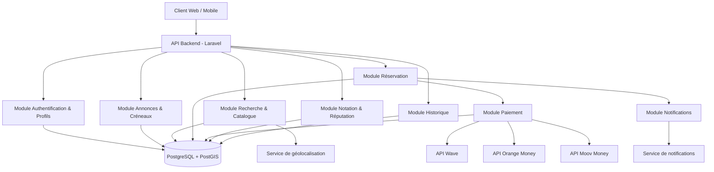
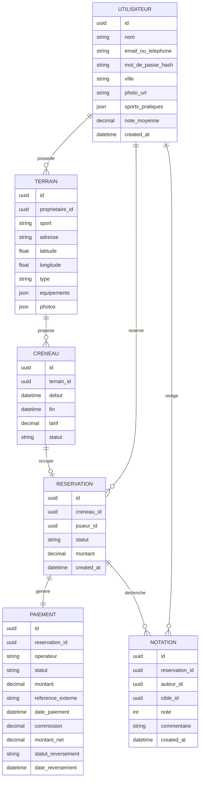

# Architecture — App de réservation de terrains de sport entre particuliers

*Rédigé le 22 août 2026, à partir du SRS validé (srs.md, rédigé le 22 août 2026)*
*Révision du 29 août 2026 : correction du modèle de données (section 3) — voir note en fin de
section 3.*

## 1. Stack technique

### Backend

| Option | Avantages | Inconvénients | Exigences couvertes |
|--------|-----------|----------------|----------------------|
| **Laravel (PHP)** | Écosystème mature pour l'intégration mobile money en Afrique de l'Ouest (packages/communauté déjà familiers de Wave, Orange Money, Moov Money) ; queues et scheduler intégrés utiles pour traiter les webhooks de paiement et les rappels ; grande disponibilité de développeurs locaux | Moins "à la mode" que Node/Python pour certaines équipes ; performances brutes inférieures à Node pour de la charge très concurrente | RNF-002, RNF-005 |
| **Node.js (NestJS, TypeScript)** | Un seul langage possible du backend au frontend/mobile (si React/React Native) ; bon débit pour de l'I/O concurrent (utile pour verrouillage de créneau RF-010) | Écosystème d'intégration mobile money local moins mature que Laravel ; plus de discipline requise pour éviter la dette technique sans framework aussi structurant | RNF-001, RNF-002 |
| **Django (Python)** | Panneau d'administration intégré très utile pour gérer litiges/remboursements côté équipe interne ; ORM robuste | Moins orienté "temps réel" ; écosystème mobile money local plus restreint que Laravel | RNF-002 |

**Recommandation** : **Laravel** — c'est l'option la mieux alignée avec le contexte (paiement Wave/Orange Money/Moov Money) : l'écosystème et les développeurs disponibles dans la zone connaissent déjà ces intégrations, ce qui réduit le risque d'implémentation sur le point le plus critique du projet (RNF-002 — sécurité des paiements, RNF-005 — disponibilité du chemin réservation/paiement).

### Frontend / Mobile

| Option | Avantages | Inconvénients | Exigences couvertes |
|--------|-----------|----------------|----------------------|
| **Next.js (web) + React Native (mobile)** | Un seul langage (TypeScript) partagé entre web et mobile, logique métier réutilisable ; large communauté | React Native peut demander du code natif ponctuel pour certaines intégrations SDK de paiement mobile money | RNF-003 |
| **Nuxt (web) + Flutter (mobile)** | Flutter offre un rendu très proche du natif et de bonnes performances sur iOS/Android | Deux langages différents (JS/Dart) pour web et mobile, pas de partage de code entre les deux | RNF-003 |
| **Web responsive seul (Vue/Nuxt) + apps natives séparées (Swift/Kotlin)** | Meilleure expérience et performance natives possibles | Trois bases de code distinctes à maintenir (web, iOS, Android) — coût de développement et de maintenance nettement plus élevé | RNF-003 |

**Recommandation** : **Next.js + React Native** — couvre la cible "web et mobile iOS/Android dès la V1" (RNF-003) avec un seul langage et un partage de logique entre les plateformes, ce qui limite les incohérences de comportement entre web et mobile pour des parcours critiques comme la réservation et le paiement.

### Base de données

| Option | Avantages | Inconvénients | Exigences couvertes |
|--------|-----------|----------------|----------------------|
| **PostgreSQL (+ extension PostGIS)** | Garanties transactionnelles fortes (essentiel pour éviter une double réservation sur un créneau, RF-010) ; PostGIS permet la recherche par proximité (RF-007) nativement | Configuration légèrement plus lourde que MySQL pour activer PostGIS | RF-007, RF-010, RNF-002 |
| **MySQL / MariaDB** | Pairing classique avec Laravel, simple à opérer, extensions spatiales disponibles | Support géospatial moins riche et moins éprouvé que PostGIS | RF-007 |
| **MongoDB** | Schéma flexible, pratique pour prototyper vite | Garanties transactionnelles multi-documents plus faibles — risque direct sur le verrouillage de créneau (RF-010) et la cohérence paiement/réservation | — |

**Recommandation** : **PostgreSQL avec PostGIS** — c'est la seule option qui répond directement aux deux contraintes les plus sensibles du projet : la cohérence transactionnelle nécessaire pour éviter qu'un même créneau soit réservé deux fois (RF-010), et la recherche géographique par proximité (RF-007).

### Hébergement / Infrastructure

| Option | Avantages | Inconvénients | Exigences couvertes |
|--------|-----------|----------------|----------------------|
| **Cloud managé (AWS/GCP) avec base de données managée** | Haute disponibilité et sauvegardes gérées, bonne base pour viser RNF-005 (99,5 %) | Coût et complexité d'exploitation plus élevés pour une V1 | RNF-005 |
| **PaaS (ex. Render, Railway, ou hébergeur régional type OVH)** | Déploiement simple, coût maîtrisé, bon compromis pour une V1 ; certains hébergeurs régionaux offrent une meilleure latence vers l'Afrique de l'Ouest | Moins de contrôle fin sur l'infrastructure qu'un cloud complet | RNF-001, RNF-005 |
| **VPS auto-géré (Docker)** | Coût le plus faible | Redondance et sauvegardes à mettre en place manuellement — risque pour RNF-005 si mal opéré | — |

**Recommandation** : **PaaS ou hébergeur régional** — meilleur compromis coût/fiabilité pour une V1, en portant une attention particulière à la latence réseau vers les API Wave/Orange Money/Moov Money (privilégier une région d'hébergement proche de l'Afrique de l'Ouest).

> **⚠️ Ce choix de stack doit être confirmé avant de considérer les sections suivantes comme figées** — voir la section Validation en fin de document.

## 2. Structure des modules/composants

| Module | Responsabilité | Exigences couvertes |
|--------|------------------|----------------------|
| Authentification & Profils | Inscription, connexion, gestion du profil joueur | RF-001, RF-002, RF-003 |
| Annonces & Créneaux | Publication d'annonces (particulier ou gestionnaire), définition des créneaux et tarifs | RF-004, RF-005, RF-006 |
| Recherche & Catalogue | Recherche par sport/localisation/date, consultation du détail d'une annonce | RF-007, RF-008, RF-009 |
| Réservation | Sélection d'un créneau, verrouillage temporaire, confirmation après paiement | RF-010, RF-014 |
| Paiement | Abstraction commune aux trois opérateurs, déclenchement du paiement, réception des webhooks, reversement | RF-011, RF-012, RF-013, RF-015 |
| Notation & Réputation | Enregistrement des notes/commentaires post-session, calcul de la note moyenne | RF-016, RF-017 |
| Historique | Consultation de l'historique des réservations (joueur et propriétaire/gestionnaire) | RF-018, RF-019 |
| Notifications | Confirmation de réservation, rappels avant créneau | RF-020 |

*Modules Should/Could have (annulation/remboursement, messagerie, recommandations, parrainage — RF-021 à RF-025) non détaillés dans ce premier découpage : à intégrer comme extensions du module Réservation/Notification une fois la V1 Must have stabilisée.*

## 3. Modèle de données

> **Correction du 29 août 2026** : `sports_pratiques` (liste parmi foot/tennis/basket) a été
> ajouté à l'entité UTILISATEUR. Ce champ était exigé par RF-001 (inscription) et RF-003 (édition
> du profil) mais absent de la version initiale du modèle de données — l'écart a été repéré lors
> de l'implémentation d'US-03. Modélisé en `json` plutôt qu'en table de jointure séparée, par
> cohérence avec `TERRAIN.equipements`/`TERRAIN.photos` qui suivent déjà ce pattern pour des
> listes de valeurs fermées : aucune exigence actuelle (recherche, filtrage) ne porte sur les
> sports pratiqués par un utilisateur, donc une table de jointure ajouterait de la complexité
> relationnelle sans bénéfice concret pour l'instant. À revisiter si une future fonctionnalité
> (ex. recommandations RF-025 Could have) doit un jour requêter les utilisateurs par sport
> pratiqué.

> **Correction du 30 août 2026** : ajout à l'entité PAIEMENT de `commission`, `montant_net`
> (= montant − commission, ce que le propriétaire/gestionnaire touche réellement),
> `statut_reversement` et `date_reversement`. Ces champs sont exigés par RF-015 ("reverser le
> montant... moins la commission éventuelle... selon un cycle de reversement défini") mais
> absents de la version initiale — écart repéré lors de la préparation d'US-15. Contrairement à
> `Reservation.expireA` (US-10), qui pouvait se déduire de `created_at` sans stockage
> supplémentaire, la commission et le statut de reversement sont des décisions métier propres à
> chaque paiement (le taux de commission peut varier, un reversement peut être effectué ou en
> attente indépendamment du paiement lui-même) : rien n'existait pour les représenter, d'où un
> vrai correctif de modèle plutôt qu'une simple hypothèse côté frontend. Modélisé comme des
> champs supplémentaires sur PAIEMENT plutôt qu'une entité REVERSEMENT séparée : un reversement
> reste 1-à-1 avec un paiement dans ce modèle (pas de regroupement de plusieurs paiements en un
> seul versement) — plus simple, et suffisant tant qu'aucune exigence n'impose un lot de
> reversement groupé. À revisiter si le cycle de reversement réel groupe plusieurs paiements en
> un seul virement bancaire au propriétaire.

## 4. Choix d'intégration

| Intégration | Utilisée par (module) | Détails techniques | Exigence(s) source |
|-------------|-------------------------|----------------------|----------------------|
| API Wave | Module Paiement | Appel API pour initier le paiement + endpoint webhook pour confirmation asynchrone | RF-011, RF-014 |
| API Orange Money | Module Paiement | Idem Wave, adaptateur dédié dans la couche Paiement | RF-012, RF-014 |
| API Moov Money | Module Paiement | Idem Wave, adaptateur dédié dans la couche Paiement | RF-013, RF-014 |
| Service de géolocalisation (ex. Mapbox / OpenStreetMap) | Module Recherche & Catalogue | Géocodage de l'adresse à la publication d'une annonce (RF-004/005), calcul de distance via PostGIS pour la recherche par proximité | RF-007 |
| Service de notifications (push type Firebase Cloud Messaging + email/SMS) | Module Notifications | Envoi de la confirmation de réservation et du rappel avant créneau | RF-020 |

La couche Paiement expose une interface commune ("adaptateur de paiement") derrière laquelle chaque opérateur (Wave/Orange Money/Moov Money) est branché comme une implémentation spécifique — ça isole le reste de l'application des différences entre API des trois opérateurs et facilite l'ajout d'un futur moyen de paiement.

## 5. Matrice de traçabilité

| Choix d'architecture | Exigence(s) SRS couverte(s) |
|------------------------|--------------------------------|
| Stack backend : Laravel | RNF-002, RNF-005 |
| Stack frontend/mobile : Next.js + React Native | RNF-003 |
| Base de données : PostgreSQL + PostGIS | RF-007, RF-010, RNF-002 |
| Hébergement : PaaS/hébergeur régional | RNF-001, RNF-005 |
| Module Authentification & Profils | RF-001, RF-002, RF-003 |
| Module Annonces & Créneaux | RF-004, RF-005, RF-006 |
| Module Recherche & Catalogue | RF-007, RF-008, RF-009 |
| Module Réservation | RF-010, RF-014 |
| Module Paiement (+ adaptateurs Wave/OM/Moov) | RF-011, RF-012, RF-013, RF-015 |
| Module Notation & Réputation | RF-016, RF-017 |
| Module Historique | RF-018, RF-019 |
| Module Notifications | RF-020 |
| Entités Utilisateur / Terrain / Créneau / Réservation / Paiement / Notation | RF-001 à RF-019 (support de données) |
| Champ UTILISATEUR.sports_pratiques *(ajouté le 29 août 2026)* | RF-001, RF-003 |
| Champs PAIEMENT.commission/montant_net/statut_reversement/date_reversement *(ajoutés le 30 août 2026)* | RF-015 |
| Intégration géolocalisation | RF-007 |
| Intégration notifications | RF-020 |
